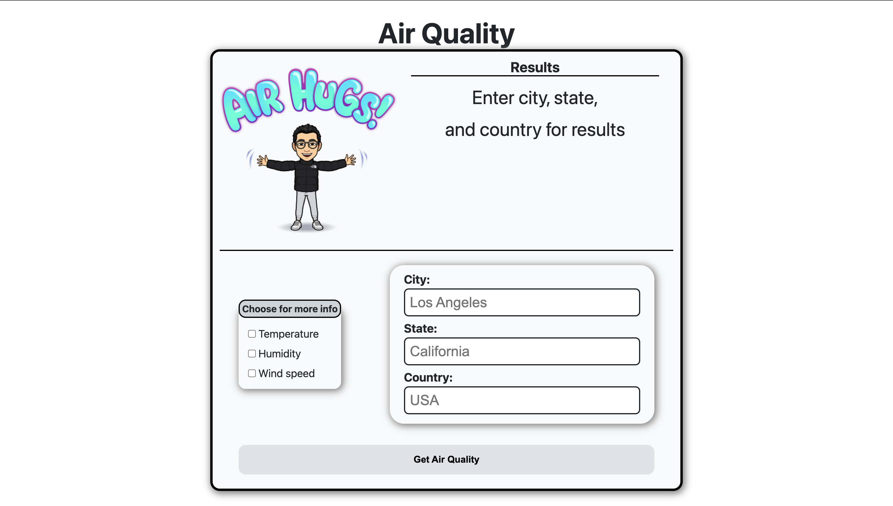

# Air Quality Website
A website that takes user input to find the air quality of a city using the **Air Quality API** by IQAir and the promise based HTTP request **Fetch API**.

## Live preview
[Click here to check the air quality of a city! ](https://kennethespaldon.github.io/airqualitywebsite/)

### Test data
Here are some data (city, state, country) for you to enter. Each set of data should result in a different image to be displayed based on the air quality.
- Set #: City, State, Country
- Set 1: Los Angeles, California, USA (Good air quality)
- Set 2: Kuwait City, Al Asimah, Kuwait (OK air quality)
- Set 3: Durgapur, West Bengal, India (Bad air quality)

If each set doesn't display a new image, look at the [IQAir Live Rankings](https://www.iqair.com/us/world-air-quality-ranking?srsltid=AfmBOoqjMOvKgKcY529i1yiIVXYXjPFEn2sGmEn5SOo7baGrTVlR_lKP) for more data to enter.